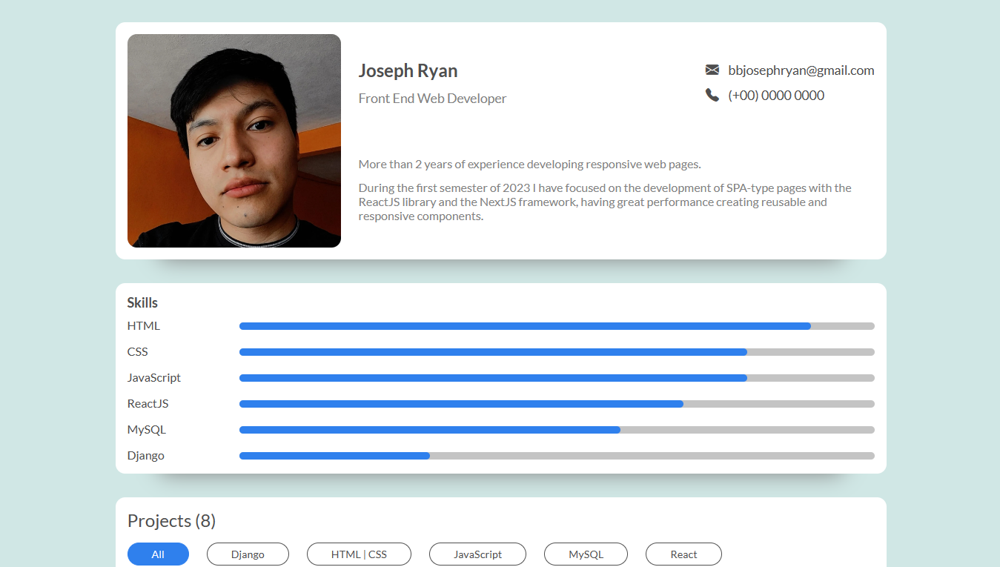

<h1 align="center">Portfolio Components</h1>

   Solution for a challenge from  <a href="https://devchallenges.io" target="_blank">Devchallenges.io</a>.

  <h3>
    <a href="https://portfolio-components.vercel.app/">
      Demo
    </a>
     | 
    <a href="https://github.com/FlakoBB/portfolio-components">
      Solution
    </a>
     | 
    <a href="https://devchallenges.io/challenges/5ZnOYsSXM24JWnCsNFlt">
      Challenge
    </a>
  </h3>

<!-- TABLE OF CONTENTS -->

## Table of Contents

- [Overview](#overview)
  - [Built With](#built-with)
- [Features](#features)
- [Contact](#contact)

<!-- OVERVIEW -->

## Overview

Portfolio created with React. Deployed in [Vercel](https://vercel.com/)

### Built With

- [React](https://reactjs.org/)
- [Webpack](https://webpack.js.org/)
- HTML
- CSS

## Features

This application/site was created as a submission to a [DevChallenges](https://devchallenges.io/challenges) challenge. The [challenge](https://devchallenges.io/challenges/5ZnOYsSXM24JWnCsNFlt) was to build an application to complete the given user stories.

## Contact

- Redes [Follow me](https://bit.ly/follow-flako)
